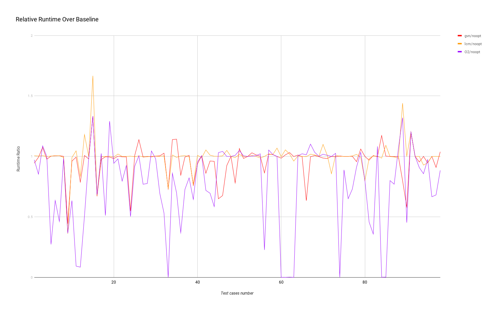

+++
title = "Partial Redundancy Elimination using Lazy Code Motion for LLVM"
extra.author = "Siqiu Yao"
extra.bio = """
  [Siqiu Yao](http://www.cs.cornell.edu/~yaosiqiu/) is a 3rd year Ph.D. student interested in security about systems and programming languages.
"""

+++

### Problem
This project aims to write a pass for LLVM that implements *partial redundancy elimination* (PRE) using *[lazy code motion](https://dl.acm.org/citation.cfm?id=143136)* (lcm).

### Algorithm Design
The algorithm is the same as the one I used in my project 2 [BrilPRE](https://www.cs.cornell.edu/courses/cs6120/2019fa/blog/brilpre/).


### Implementation
This project is implemented as an LLVM pass, and it is based on [llvm-pass-skeleton](https://github.com/sampsyo/llvm-pass-skeleton). 
The full implementation repository is [here](https://github.com/Neroysq/BrilPRE).

Although the algorithm is the same, LLVM IR is way more complex than Bril, and its framework also takes more time to learn than building from scratch when I dealt with Bril. Here I'd like to talk about the biggest challenge and also the most significant difference from BrilPRE: LLVM IR's SSA form.

In the LLVM IR framework, 
There are no names for local variables/registers (at least in compiler-generated code). 
There are only pointers representing the results of instructions, 
which means I cannot create a new variable with a specific name. 

I can use built-in functions to create an instruction and get the result pointer, 
but the real trouble is that I don't find a way to implement this: 
create the same instruction in two branches, 
and refer them using one pointer after branches merge. 
What I can do is to create a `phi` function to get a merged result, 
but this breaks a beautiful property of the original algorithm: 
for each expression, 
this algorithm only creates one new variable,
then for any evaluation of this expression, 
either it is the first evaluation in this path so that we evaluate it and assign the result to this variable, 
or we just replace it with this variable. 
I think this is beautiful because in the implementation I only need to maintain a map storing the corresponding variables of each expression, 
but in this project, 
I need to maintain this map on the fly since all pointers are different, and `phi` functions also introduce changes to this map.

Also, since the code is in SSA form, 
the values of each variable (register) never change,
which means expressions also never change.
Therefore, 
some analysis in lazy code motion becomes useless,
for example, `kill(b)` means the set of expressions whose values are changed in block `b`.
For LLVM IR, it is always empty.
This shows that SSA form is not the most ideal situation to apply this algorithm, and there are PRE algorithms designed for SSA form, such as ["A new algorithm for partial redundancy elimination based on SSA form"](https://dl.acm.org/citation.cfm?id=258940).


### Evaluation
To first test the correctness I manually test some tiny programs and make sure the results of the standard compiler and my pass match. 
Then, 
I use a tool [tf](https://github.com/guilhermeleobas/tf), 
which can help run LLVM's test-suite benchmarks, 
to run large-scale test sets.

#### Setting

The benchmarks I run contains: 

```
BenchmarkGame, CoyoteBench, Dhrystone, Linpack, McGill, Misc, PolyBench, Shootout, Stanford
```

They all come from `llvm-test-suite/SingleSource/Benchmarks` and contain 98 programs in total.

I compare the performance of four settings:
1. The baseline: compile with only one pass `mem2reg`, which translates C code to SSA form LLVM IR.
2. LLVM's built-in PRE: compile with passes `mem2reg, gvn, simplifycfg`, which claims to perform redundant load elimination in addition to PRE, 
3. My implementation `lcm` (a pass called `PRE`): compile with passes `mem2reg, PRE, simplifycfg`.
4. Current state-of-the-art overall optimization: compile using `clang` with the option `-O2`.

#### Result 



Above is a chart showing relative runtime running my select benchmarks of the later three settings over baseline. 
The result shows that:

1. Overall, both `gvn` and `lcm` occasionally optimize the program significantly (ratio < 0.9): 15/98 for `gvn`, and 7/98 for `lcm`.
2. Sometimes, PRE makes performance significantly worse (ratio > 1.1): 6/98 for `gvn`, and 4/98 for `lcm`.
3. `gvn` performs better in more cases than `lcm`: 55 out of 98.
4. There are 15 out of 98 cases where `gvn` performs significantly better (ratio < 0.9) than `lcm`;  there are 7 out of 98 cases where `gvn` performs significantly better (ratio < 0.9) than `lcm`; 
5. There are 43 out of 98 cases where `-O2` is significantly better (ratio < 0.9) than both `gvn` and `lcm`.

### Conclusion
In conclusion, I successfully implemented a partial redundancy elimination pass for LLVM and tested its correctness and performance. I found it very exciting to see my implementation can do a significantly better job in some of the test cases. I guess the reason is that `lcm` does a better job to reduce register pressure. And since `-O2` performs equally well in these cases, I think that  other passes in `-O2` cover register pressure optimization.