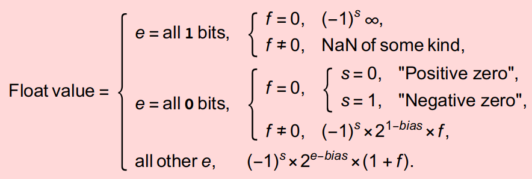
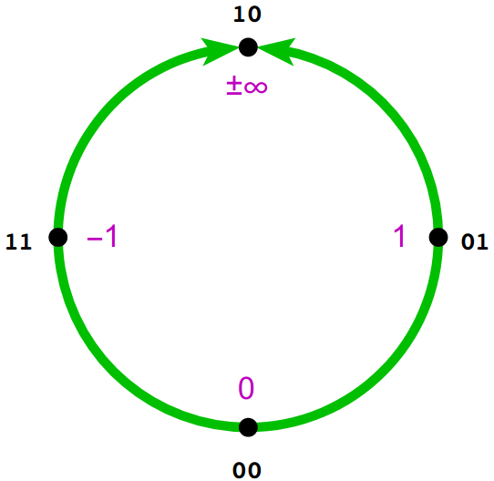
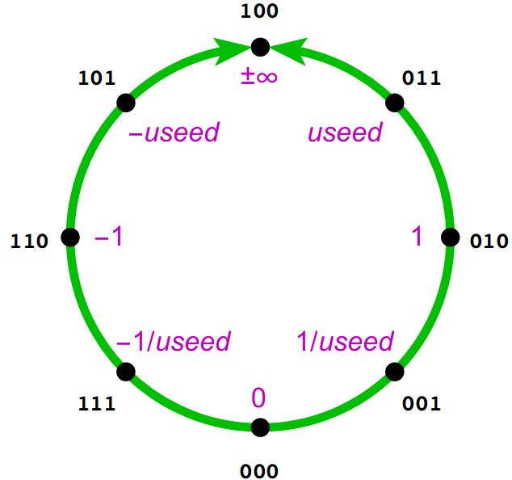
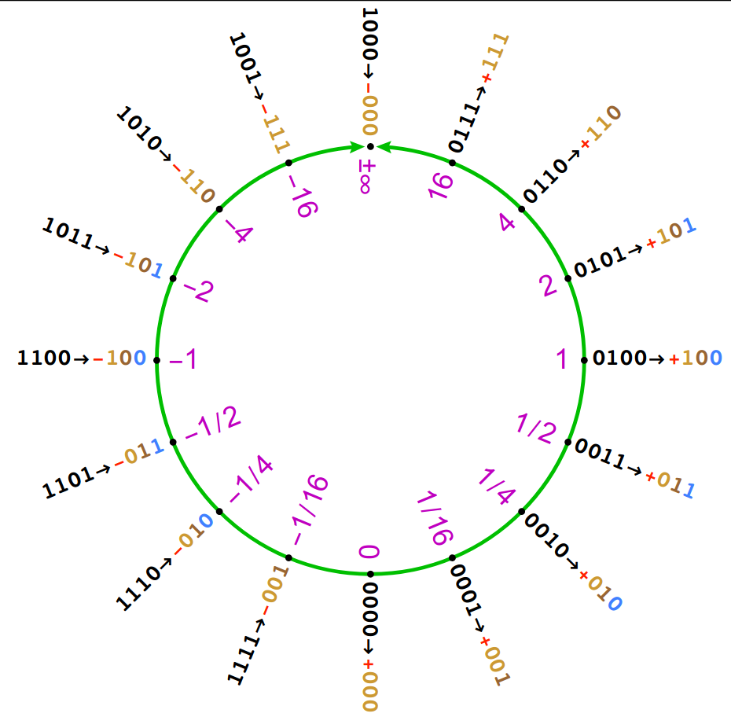
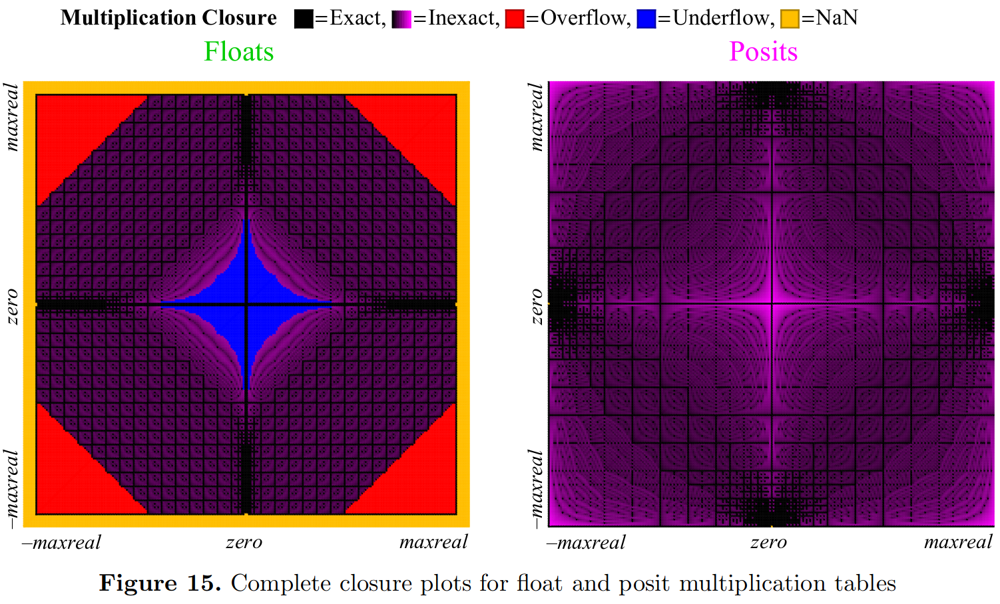
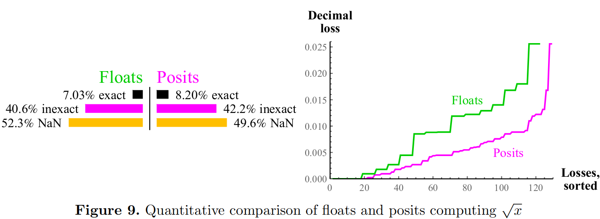

+++
title = "The Cult of Posits"
extra.author = "Dietrich Geisler & Edwin Peguero"
+++

Computers are incapable of representing arbitrary real numbers exactly.
This is due to two intractable facts of real numbers:
- Uncountably Infinite Domain: There are an infinite number of real numbers.
- Uncountably Infinite Precision: Some real numbers require infinite precision.
 
Since computers use a finite number of bits, computer architects must settle on capturing a finite number of real numbers at a finite level of precision.
This is done by fixing a mapping between bit patterns and real numbers called a *representation*.
A representation makes a tradeoff between the quantity of representable numbers and the level of precision.

## The Floating Point Representation

The *floating point* representation is the most widely used.
Numbers are written in the form `(-1^s) * 1.m * 2^e`, where `1.m`, the *mantissa*, and `e`, the *exponent*, are fractional and integer binary values, respectively, and `s` is a single bit denoting the sign of the represented number.
The design tradeoff between quantity and precision is captured by the number of bits dedicated to the mantissa and exponent.

In practice, however, the IEEE 754 floating point standard slightly modifies this scheme to account for two perceived limitations:
- Small Number Gap: there is a relatively large gap between the representation of the largest negative number, and the smallest positive number
    - To account for this, the numbers with the smallest exponent are *denormalized*. 
    Denormalized values are spread out linearly, rather than exponentially.
    For floating points, denormalization occurs between the largest negative and smallest positive numbers raised to the second largest exponent.

Before denormalization:


After denormalization:


- Bogus Results: the result of overflow (e.g., dividing by a very small number) or partial functions applied to elements outside of their domains (e.g, division by zero) have no representation
    - The case of overflow is captured by the *positive and negative infinity* values, each represented by the bit pattern corresponding to an all ones exponent and all zeros mantissa, and differentiated by the sign bit.
    - The case of a non-result of a partial function is captured by the *NaN* value (meaning, "not a number"), represented by the various bit patterns with an all ones exponent and non-zero mantissa.

All this results in a glutonous representation:



## The Posit Representation

The *posit representation* _should_ be the most widely used representation.
The numbers represented by posits are similar to floating points, but differ by the introduction of a so-called *regime* term, as follows: 

````(-1^s) * 1.m * useed^k * 2^e````

`useed = 2^(2^es)`, a fundamental quantity in the theory of numerical representations, parametrized by the quantity `es`.

In his [seminal paper](https://posithub.org/docs/Posits4.pdf), Gustafson explains the _genius_ behind this design:
> The regime bits may seem like a weird and artificial construct, 
but they actually arise from a natural and elegant geometric mapping of binary integers to the projective real numbers on a circle.

> ... The value 2^(2^es) is called useed because it arises so often.

Fascinating. 

The purity of posits is reflected in its effortless expression:


## The Divinity of Posits

The posit representation maps numbers around the topological circular loop in religiously significant quadrants.


At the heavenly North of the circle, symbolizing the Alpha and Omega, Our Father to which we solemly pray, lies the glorious positive and negative infinity.
At its opposite, the wicked, immoral South of the circle, lies nothing of value, the value `0`.
Meanwhile, on the earthly plane, God's children enjoy free will, where they choose between positive one at the East and negative one at the West.

The quadrants induced by these points are then symmetrically populated by the rest of the points. 
The `useed` determines where the "center" of these quadrants resides as follows:


Much like Adam and Eve, the `useed` determines how the quadrants in the circle are populated.
Positive values lie at the right of the circle, while negative values lie at the left, and reciprocal values reflect across the equator.




# Comparing Numerical Representations
Tragically, we live in a fallen world, full of non-believers and doubting Thomases.
This necessitates effective proselytizing that speaks not only to broken spirits, but also to faithless minds.

## Qualitative Comparison

Unlike IEEE's extravagantly piecewise nature, posits opt for piecewise minimalism:
- Whereas there are two floating point representations of zero (both positive and negative), there is only one such posits representation: the all zero bit pattern.
- Whereas positive and negative infinity are distinctly represented as floating points, posits unite these values into one representation: the bit pattern with all zeros save for the first bit.
- Whereas floating point numbers are polluted with `NaN` values, posits are cleansed of such unclean special values.

Often, this simple observation suffices to awaken floating point enthusiasts out of their delusion.

## Decimal Accuracy Comparison

At other times, a more quantitive approach is called for;
to this end, Gustafson proposes a variety of metric-based comparisons for numerical representation.
First, he asks: how can we assess how accurately a number is represented in a given representation?
To answer this, he proposes the *decimal accuracy* metric: the number of significant bits of a real number on a logarithmic scale, as in the decibel system.

Charitably, Gustafson elucidates non-believers why the logarithmic scale is the one true choice:
  > A “perfect spacing” of ten numbers between 1 and 10 in a real number system would be not the evenly-spaced counting numbers 1 through 10, 
  > but exponentially-spaced 1,10^(1/10),10^(2/10),...,10^(9/10),10.

Thus, the "canonical position" of a (positive, non-zero) real number `n` is given by `p`, where `n = 10^(p/10)`,
and so it follows that the distance, or representation error, between a real number `n` and its representation `n'` is given by `| log_10(n / n') | `.
A straightforward adjustment adapts this scheme to negative numbers as well, and we ignore zero, since posits represents it exactly.
The inverse of this error which yields the *perfect metric for accuracy*.
Equipped with this metric, we glean the significant digits of the representation, the *decimal accuracy*, by taking its base 10 logarithm.

Gustafson exhaustively plots decimal accuracy for both representations in 8-bits, demonstrating posit supremacy:


We make two observations from this plot:
First, posits distribute decimal accuracy symmetrically across representations, while floating points fail to deliver at larger numbers, which are ignored in favor of `NaN`.
Furthermore, posits favor decimal accuracy at the meat of the number line, a sizable domain around 0, whereas floating points over-emphasizes the ends of the number line.
Finally, posits represents more numbers: they cast the light of representation across a larger domain. 
In other words, the *dynamic range* of posits, a further metric, exceeds that of floating points.

## Operation Accuracy Comparison

Besides raw representation error, there is the possibility of errors generated from primitive operations.
Gustafson addressed this for basic arithmetic operations by means of "closure plots".
Such a plot visually depicts the accuracy of every combination of inputs.
For instance, the multiplication closure plot below paints the input domain darker where more accurate results are achieved, as measured by decimal accuracy:



Accuracy of single argument operations between representations are compared by plotting sorted error.
For instance, Gustafson compares accuracy of square root in the following plot:




# Evaluation

As part of our cultist duties, we compare the accuracy of 32-bit floating point and posit representation by comparing their accuracy under a variety of benchmarks.
In each benchmark, we express real number calculations in terms of operations over 64-bit `double`s.
In other words, the `double` type serves as the "oracle" baseline from which we compute accuracy.
Each `double` benchmark is then compiled to LLVM IR, upon which we apply a `posit` LLVM pass and a `float` LLVM pass respectively to generate associated benchmarks.

Finally, we compute percent error by comparing `float` and `posit` benchmark results to the `double` baseline benchmark.
We regard benchmark errors as arising from the inaccuracy that is characteristic of the particular 32-bit representation, compounded with successive operations.
With our deepest apologies to Gustafson, we compute these errors on a linear scale, rather than a logarithmic one, and use these as metrics to compare the accuracy of the two representations.


## LLVM pass implementation

We aimed for our `float` and `posit` passes to insert as much representation-specific functionality as possible into our benchmarks.
The case of `float`s allows a full translation, since every `double` operation can be cast as a `float` operations.
The case of `posit`s lacked full support, however: we did not provide implementations for all existing LLVM `double` operations.

To accommodate both cases under one pass implementation, 
we designed our pass such that it first lowers each supported `double` operation and operands down to the target representation, subsequently lifting the result back to a `double`.

Since each rewrite has a purely local effect, we can avoid reasoning about complex allocation and type casting scenarios.
Though computationally inefficient, this approach immediately supports all programs and is easily extendible.

In pseduo-LLVM, the general structure of a pass to type `typ` converts an arbitrary `double` operation `op` and its operands proceeds as follows:

```llvm 
x : double = ..
y : double = ..
result : double = op double x y
```

-->


```llvm
x : double = ..
y : double = ..

x_typ : typ = convert double x to typ;
y_typ : typ = convert double y to typ;
result_typ : typ = typ_op x_typ y_typ; 

result double = convert result_typ typ to double
```

This generic pass structure parametrizes `typ` into three components:
- `convert double to typ`: conversion from `double` to `typ`
- `convert typ to double`: conversion from `typ` to `double`
- `typ_op`: implementation over `typ` values of `op`, the corresponding `double` operation

The `float` pass specifies these components as:
- `fptrunc double to float`
- `fpext float to double`
- LLVM's floating point operations with type parameter set to `float` (e.g., `fadd float x y`)

The `posit` pass draws these components from external `C` functions implemented in [Cerlane Leong's SoftPosit repository](https://gitlab.com/cerlane/SoftPosit-Python).
In particular, we borrow the basic arithmetic operations (`+`, `-`, `*`, and `/`) over 32-bit posits. 


### Benchmark Results

We ran several benchmarks from [FPBench](https://fpbench.org/benchmarks.html) that accomodated our limited selection of posit operators.
Here, we list their names, sample sizes, and associated results:


| `sum` | Mean Error | Error Std Dev |
|-------|------------|---------------|
| Float | 7.7e-8     | 4.8e-8        |
| Posit | 5.1e-9     | 3.2e-9        |
|`n`= 1000 |||


| `x_by_xy` | Mean Error | Error Std Dev |
|-------|------------|---------------|
| Float | 1.1e-7     | 9.2e-8        |
| Posit | 6.9e-9     | 5.7e-9        |
| `n` = 961 | | |


| `delta4` | Mean Error | Error Std Dev |
|-------|------------|---------------|
| Float | 5.8e-7     | 6.5e-6        |
| Posit | 3.6e-8     | 3.8e-7        |
| `n`= 262144 |   |    |


| `kepler0` | Mean Error | Error Std Dev |
|-------|------------|---------------|
| Float | 2.5e-7     | 1.0e-7        |
| Posit | 1.6e-8     | 7.9e-9        |
| `n`= 262144  |  |        |


| `floudas1`  | Mean Error | Error Std Dev |
|-------|------------|---------------|
| Float | 2.1e-7     | 1.6e-7        |
| Posit | 1.4e-8     | 1.2e-8        |
| `n`= 92572956 |   |        |


# Discussion

As prophesied by Gustafson, posits consistently outperform floating points by orders of magnitude.
However, our LLVM `posit` pass is grossly inefficient: it introduces loads and stores operations to convert between `double` and `posit` for each `double` operation.
We blame this sad state of affairs on ignorant, non-posit architectures, which necessitate such a pass in the first place.

Gustafson shares what we're missing out on by not being woke:
>  A posit processing unit takes less circuitry than an IEEE float FPU. With lower power use and smaller silicon footprint, the posit operations per second (POPS) supported by a chip can be significantly higher than the FLOPS using similar hardware resources. GPU accelerators and Deep Learning processors, in particular,can do more per watt and per dollar with posits, yet deliver superior answer quality
Indeed, we could be talking in terms of POPS instead of FLOPS.
Nonetheless, our pass allows us to simulate and give thanks for posit accuracy.

As mentioned previously, our approach treats `double` as the "ground truth" representation for benchmarks. 
Although this is an approximation, since no finite representation has perfect accuracy, 
we assume that the accumulated error in `double` benchmarks will be truncated or rounded off when comparing with the less precise 32-bit representations.
In other words, we assume that casting to a `double` from a `float` or 32-bit `posit` can be done without loss of information.
Although this assumption does not always hold, we found it to be sufficient for practical testing and justified the streamlined design of our LLVM pass.

# Conclusion: The Posit Prayer

Every morning and every evening, run your favorite posit benchmark and recite the following:
> [posits] provide compelling advantages over floats, including larger dynamic range, higher accuracy, better closure, bitwise identical results across systems, simpler hardware, and simpler exception handling.

Confess your use of floating points, repent, and be cleansed.
Contact the authors for induction into the Cult of Posits.
